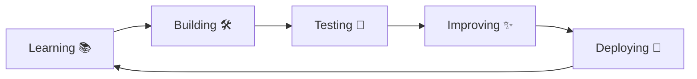

  
  
  

<i>Building practical projects, learning new technologies, and turning ideas into working applications.</i>

## 🚀 About Me

Me

🔭 Currently working on **Full-Stack & AI-based projects**
🌱 Learning **Advanced MERN Stack, AI/ML & System Design**
💡 Interested in **Web Development, Artificial Intelligence & Automation**
🛠️ Love building **real-world applications**
🎯 Focused on improving my **problem-solving and development skills**
🤝 Open to **collaboration and interesting projects**

## 🧰 Tech Stack

**💻 Languages**

**🌐 Web Development**

**🛠️ Tools & Technologies**

## 📊 GitHub Analytics

### 🔥 Contribution Streak

## ⭐ Featured Projects

<table>
<tr>

<td width="50%">

### 🚀 Project One

**Full-Stack Web Application**

A practical web application with authentication, database integration and a responsive user interface.

**Tech:** `React` `Node.js` `Express` `MongoDB`

</td>

<td width="50%">

### 🤖 AI Project

**AI-Powered Application**

An intelligent application focused on automation, data processing and solving real-world problems with AI.

**Tech:** `Python` `AI/ML` `API`

</td>

</tr>

<tr>

<td width="50%">

### 🛒 MERN Application

**E-Commerce Platform**

A complete MERN app with user authentication, product management and an admin dashboard.

**Tech:** `MongoDB` `Express` `React` `Node.js`

</td>

<td width="50%">

### 🧠 More Projects

Explore my repositories for more experiments, learning projects and applications.

</td>

</tr>
</table>

## 📌 My Development Journey

## 🐍 Contribution Snake

<picture>
  <source media="(prefers-color-scheme: dark)" srcset="https://raw.githubusercontent.com/dnyaneshwar7779/dnyaneshwar7779/output/github-snake-dark.svg"/>
  <source media="(prefers-color-scheme: light)" srcset="https://raw.githubusercontent.com/dnyaneshwar7779/dnyaneshwar7779/output/github-snake.svg"/>
  
</picture>

## 📊 More GitHub Stats

## 🤝 Let's Connect

<!-- Add your LinkedIn URL in place of # -->

<!-- Add your portfolio URL in place of # -->

  

### 💙 Thanks for visiting my profile!

**If you find my projects useful, consider giving them a ⭐**

